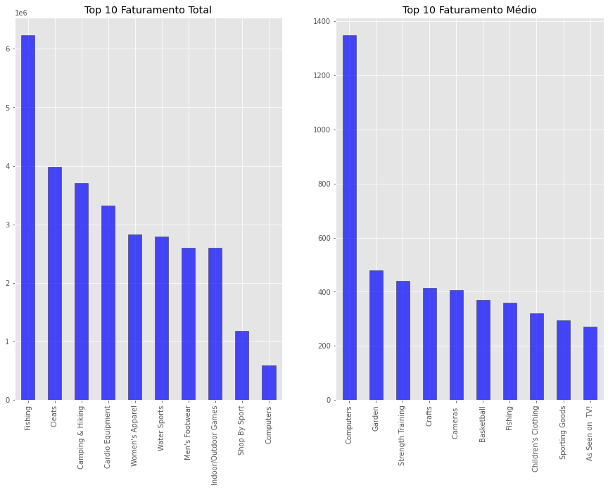
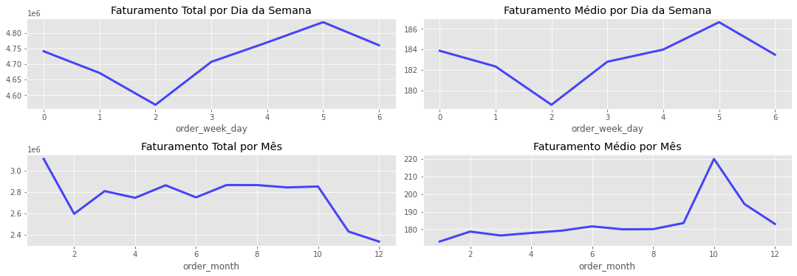
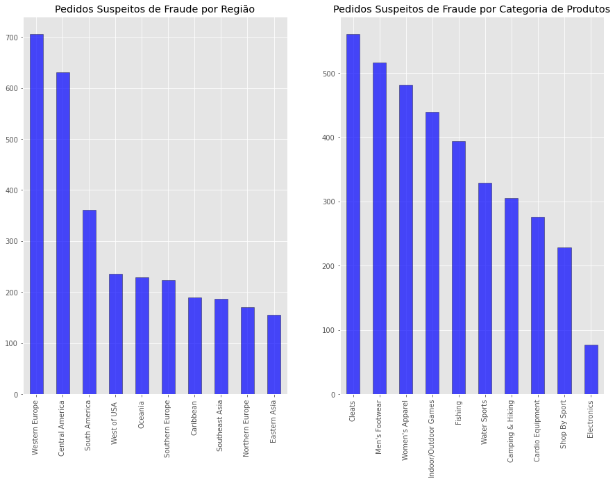

Esse é um projeto de classificação e clusterização.

O conjunto de dados utilizado está disponível [neste link](https://github.com/rafaelgfelippe/SupplyChainAnalytics). 

# Entendimento do Negócio

A GO Market é uma empresa de E-commerce que oferece em seu site diferentes tipos de produtos, desde peças de vestuário até aparelhos eletrônicos. Com clientes ao redor do mundo, a empresa também é a própria responsável por realizar o transporte e a entrega dos pedidos.

Um dos principais desafios da GO Market é justamente em relação a gestão dos pedidos. Atualmente, mais de 50% dos pedidos são entregues de maneira atrasada. Visando solucionar esse problema, a empresa deseja criar um sistema a fim de prever o risco de atraso de cada pedido, e assim, tomar medidas proativas para evitar que o atraso ocorra, gerando um aumento na satisfação dos clientes.

Outro fator importante mencionado pela GO Market é a segmentação de seus clientes. Por meio dela, a empresa deseja conhecer melhor seu público, e assim, oferecer uma experiência personalizada, fazendo com que se sintam ainda mais valorizados. Logo, esse projeto tem como objetivo segmentar os clientes da GO Market e responder a seguinte pergunta:

- **Quais os pedidos possuem risco de atraso em sua entrega?**

# Dicionário de Dados

Em relação ao conjunto de dados, as seguintes informações foram disponibilizadas:

- Os dados estão em formato estruturado e serão disponibilizados em um arquivo "csv".
- A variável **`Late_delivery_risk`** é a variável target.

Além disso, também foi disponibilizado o dicionário de dados:

**OBS:** os significados dos valores presentes em cada variável estão disponíveis no notebook.

| Variáveis                        | Descrição                                                    |
| -------------------------------- | ------------------------------------------------------------ |
| Type                             | Tipo do pagamento realizado pelo cliente                     |                          
| Days for shipping (real)         | Período levado para realizar a entrega do pedido (em dias)   |
| Days for shipment (scheduled)    | Prazo estimado para a entrega do pedido (em dias)            |
| Benefit per order                | Valor do lucro/prejuízo do pedido                            | 
| Sales per customer               | Valor total do pedido após o desconto                        |
| Delivery Status                  | Status da entrega do pedido                                  |
| Late_delivery_risk               | Risco de atraso na entraga do pedido (1 = sim, 0 = não)      |
| Category Id                      | Código de identificação da categoria do produto              |
| Category Name                    | Descrição da categoria do produto                            |
| Customer Email                   | Email do cliente                                             |
| Customer Fname                   | Nome do cliente                                              |
| Customer Id                      | ID do cliente                                                |
| Customer Lname                   | Sobrenome do cliente                                         | 
| Customer Password                | Senha do cliente                                             |
| Customer Segment                 | Categoria de cliente                                         | 
| Latitude                         | Latitude da localização do cliente                           |
| Longitude                        | Longitude da localização do clinte                           |
| Market                           | "Mercado" para onde o pedido será enviado                    | 
| Order City                       | Cidade de destino do pedido                                  |
| Order Country                    | País de destino do pedido                                    |
| Order Customer Id                | Id do pedido do cliente                                      |
| order date (DateOrders)          | Data que o pedido foi realizado                              |
| Order Id                         | Código da encomenda                                          |
| Order Item Cardprod Id           | Código do produto gerado através do leitor RFID              |
| Order Item Discount              | Valor do desconto                                            |
| Order Item Discount Rate         | Porcentagem de desconto                                      |
| Order Item Id                    | Código de identificação do pedido                            |
| Order Item Product Price         | Preço do produto sem desconto                                |
| Order Item Profit Ratio          | Taxa de lucro                                                |
| Order Item Quantity              | Quantidade do produto no pedido                              |
| Sales                            | Valor do pedido sem desconto                                 |
| Order Item Total                 | Valor total por pedido                                       |
| Order Profit Per Order           | Lucro do pedido                                              |
| Order Region                     | Região de destino do pedido                                  |
| Order State                      | Estado de destino do pedido                                  |
| Order Status                     | Status do pedido                                             |
| Order Zipcode                    | CEP de destino do pedido                                     |
| Product Card Id                  | Código de identificação do produto                           |
| Product Category Id              | Código de identificação da categoria do produto              |
| Product Description              | Descrição do produto                                         |
| Product Image                    | Link de compra do produto                                    |
| Product Name                     | Nome do produto                                              |
| Product Price                    | Preço do produto                                             |
| Product Status                   | Produto em estoque (1 = sim, 0 = não)                        |
| Shipping date (DateOrders)       | Data e hora exatas do envio do pedido                        |
| Shipping Mode                    | Método de envio do pedido                                    | 

# Estratégia da Solução

Como estratégia para a solução dos problemas, definimos as seguintes etapas:

- **1. Entendimento do Negócio:** essa etapa é basicamente o que vimos até aqui: especificamos o problema de negócio, entendemos a necessidade do cliente e definimos os objetivos.

- **2. Entendimento dos Dados:** aqui, iremos realizar um primeiro tratamento nos dados, identificando valores ausentes e excluindo variáveis irrelevantes e duplicadas. Além disso, também iremos realizar uma análise detalhada em cada variável a fim de entender o que elas representam. Por fim, realizaremos a seleção das melhores variáveis para a modelagem.

- **3. Pré-Processamento dos Dados**: nesta etapa, nosso objetivo é preparar os dados da etapa anterior para aplicação do modelo preditivo. Aqui, iremos realizar a divisão do conjunto em treino e teste, a codificação das variáveis, e a padronização dos dados.

- **4. Modelagem Preditiva**: focaremos em solucionar o primeiro problema de negócio da empresa através da criação e avaliação de um modelo preditivo.

- **5. Segmentação de Clientes**: através da análise RFM, iremos segmentar os clientes da empresa.

- **6. Conclusões Finais**: por fim, entregaremos o resultado final do projeto.

# TOP 3 Insights 

**P3. Qual a categoria de produtos registrou o maior faturamento?**  
- A categoria *Fishing*, ou seja, produtos de pesca, registrou o maior faturamento total. 
- A categoria *Computers* registrou o maior faturamento médio.
 

**P4. Qual o dia da semana e mês que registraram o maior faturamento?**  
- Sábado(5) é o dia da semana responsável pelo maior faturamento total e médio.
- Janeiro é o mês que registrou o maior faturamento total, e outubro, o maior faturamento médio. 

**P7. Qual a região e a categoria de produtos que possuem o maior número de pedidos suspeitos de fraude?**  
- A Europa Ocidental e a América Central foram as regiões que registraram os maiores números de pedidos suspeitos de fraude.
- Em relação as categorias, *Cleats*, é o item que registrou o maior número de pedidos suspeitos de fraude.

# Modelagem Preditiva

Como forma de selecionar o melhor algoritmo para o problema de negócio, utilizamos a métrica *f1-score* para treinar e avaliar diferentes modelos. 

| ***Model***                 | ***f1-score***   |
|:---------------------------:|:----------------:|
| AdaBoostClassifier	        | 0.668033   	     | 
| ExtraTreesClassifier	      | 0.668033   	     |  	
| GradientBoostingClassifier  | 0.668033   	     |
| LogisticRegression   	      | 0.668033   	     |	
| RandomForestClassifier      | 0.668033   	     |
| XGBoost                     | 0.668033   	     |

Após a seleção do *ExtraTreesClassifier*, dois modelos foram criados conforme abaixo: 

- ***model***: Com hiperparâmetros originais
- ***model2***: Com otimização dos hiperparâmetros

O desempenho dos modelos foram os seguintes: 

| ***Model***   | ***accuracy***  | ***precision***   | ***recall***   | ***f1-score***   |
|:-------------:|:---------------:|:-----------------:|:--------------:|:-----------------|
| model         |                 |                   |                |                  |
| model2        |                 |                   |                |                  |

Sendo assim, o ***model2*** foi escolhido para a entrega final.

# Segmentação de Clientes

